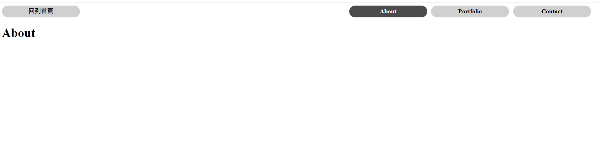

## A22：Express 基礎驗收
使用 Express 及 Node.js　建立，點選上方選單可切換頁面

### 頁面呈現


## 如何使用
1. 安裝 Node.js 及 npm
2. clone 專案到本地 3.在本地開啟後，透過終端機進入資料夾，輸入：

```bash
npm install
```

4. 安裝完畢，繼續輸入:

```bash
npm run start
```

5. 若成功運行，則會看到底下訊息，可複製網址至瀏覽器查看：

```bash
Express is running on http://localhost:3000
```

6. 要停止時則按 ：

```bash
ctrl + c
```

## 開發工具

- Node.js
- Express 4.18.2
- Handlebars 3.0.0
